# 📉 Customer Churn Prediction
### End-to-End ML System · XGBoost · SHAP · Power BI · Flask API · Deployed on Railway

[](https://web-production-c6a31.up.railway.app/)
[](https://www.python.org/)
[](https://xgboost.readthedocs.io/)
[](https://flask.palletsprojects.com/)
[](https://powerbi.microsoft.com/)


A professional, end-to-end Machine Learning solution for predicting customer churn. This project provides a **real-time Flask REST API** backed by an **XGBoost classification model**, packaged with a highly interactive, responsive web dashboard for business users.

*🚀 **Live Demo**: [https://web-production-c6a31.up.railway.app/](https://web-production-c6a31.up.railway.app/)*

---

## 🌟 Key Features

*   ⚡ **Real-time Scoring**: Get instant churn predictions along with percentage probabilities.
*   📦 **Batch Prediction processing**: Score thousands of customers at once by uploading a JSON or CSV array.
*   🔍 **Model Interpretability**: Provides the top driving risk factors for every prediction using data from SHAP.
*   🎨 **Interactive Dashboard**: A sleek, modern user interface built using vanilla HTML/CSS/JS with smooth animations and dynamic SVGs.
*   ☁️ **Cloud Native**: Fully containerized and optimized for deployment on Serverless or ephemeral platforms like Railway

## 🎯 Problem Statement

Telecom companies lose **26.5% of customers annually** to churn — each lost customer represents $500–$2,000+ in lifetime value. This project builds a **production-grade ML system** on 7,043 IBM Telco records to identify which customers are at risk of cancelling, enabling a retention team to intervene proactively before revenue is lost.

---

## 📊 Key Results

| Model | AUC-ROC | Recall | Precision | F1 |
|---|---|---|---|---|
| **XGBoost** *(production)* | **0.8469** | **0.8021** | 0.5172 | 0.6289 |
| Random Forest | 0.8429 | 0.8021 | 0.5119 | 0.6250 |
| Logistic Regression *(baseline)* | 0.8465 | 0.7727 | 0.5097 | 0.6142 |

**XGBoost was selected for production** — highest AUC and Recall tied with RF, but with faster inference and native class imbalance handling via `scale_pos_weight`.

> **Why Recall over Accuracy?** Missing a churner (false negative) costs the company ~$1,500 in LTV. Incorrectly flagging a loyal customer (false positive) costs only ~$30 in a retention offer. Recall-first metric design reflects this 50× cost asymmetry.

---

## 🖥️ Power BI Dashboard

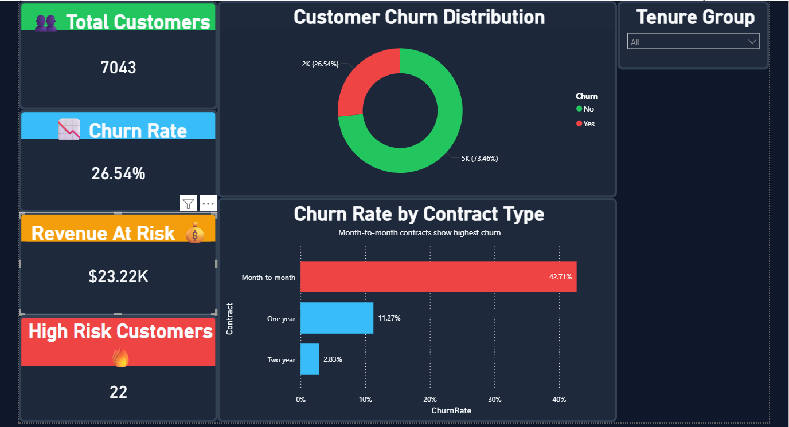
*Page 1 — Executive KPI Overview: 7,043 customers · 26.54% churn rate · Churn  rate by contract type*

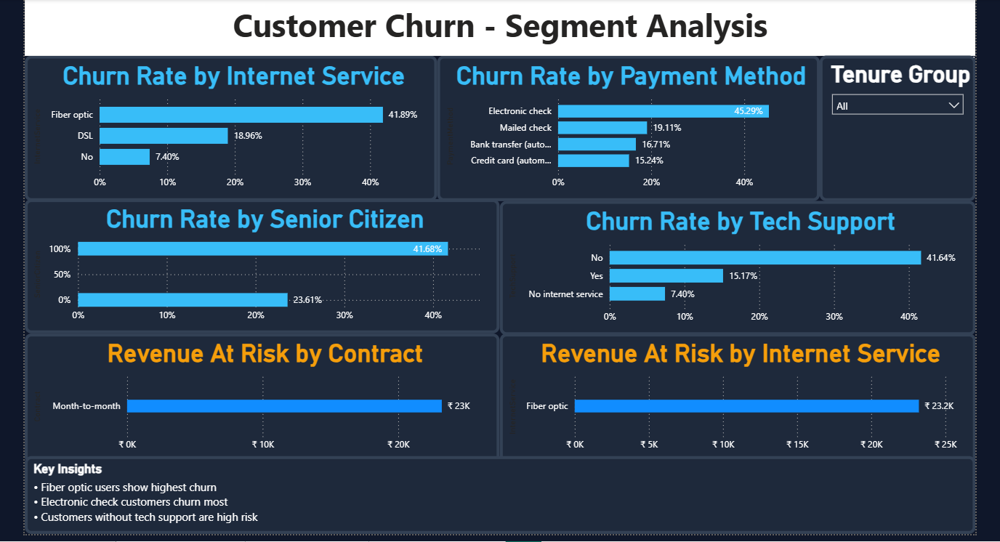
*Page 2 — Segment Analysis: Churn rate by internet service, payment method, senior citizen status, tech support*

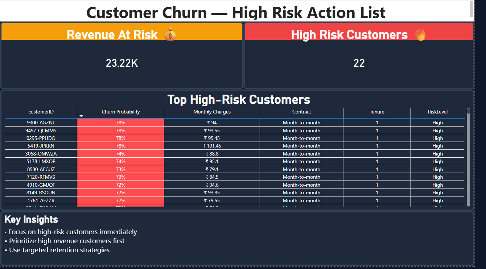
*Page 3 — High-Risk Customer Action List: Ranked by churn probability for targeted retention outreach*

---

## 💡 Top Business Insights

| # | Finding | Impact |
|---|---|---|
| 1 | Month-to-month customers churn at **15× the rate** of two-year contract customers (42.7% vs 2.8%) | Highest-priority retention lever |
| 2 | Customers in their **first 12 months** churn at 48% — nearly double the overall rate | Onboarding is the critical window |
| 3 | Fiber optic internet users churn at **2.2× the rate** of DSL users (41.9% vs 19.0%) | Pricing/value mismatch signal |
| 4 | Electronic check users churn at **45.3%** vs ~16% for auto-pay methods | Payment friction drives exit |
| 5 | Customers without tech support churn at **41.6%** vs 15.2% with support | Support services are a retention tool |

---

## 🔍 EDA Highlights

<details>
<summary>View EDA Plots (9 charts)</summary>

### Churn Distribution
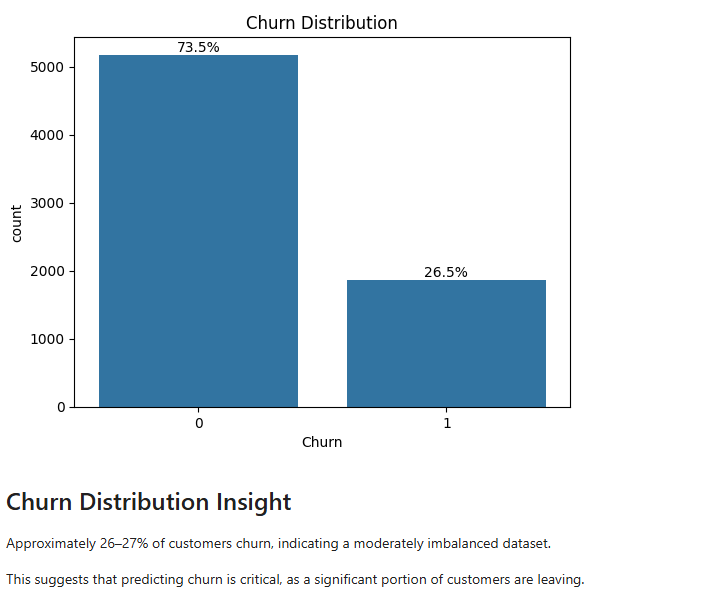

### Churn Rate by Contract Type
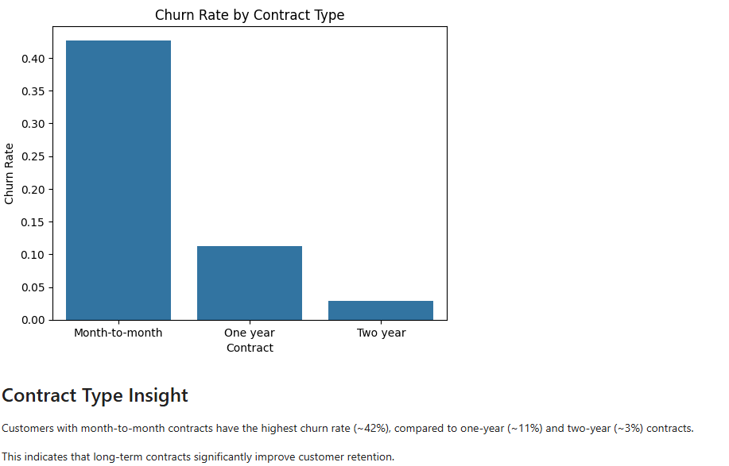

### Tenure Distribution by Churn
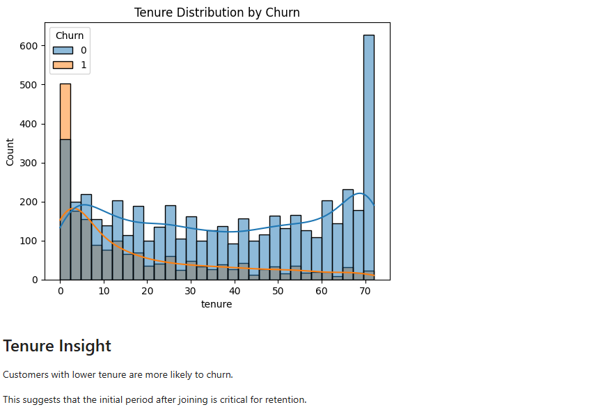

### Churn by Tenure Group
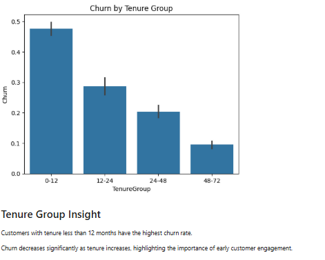

### Monthly Charges vs Churn
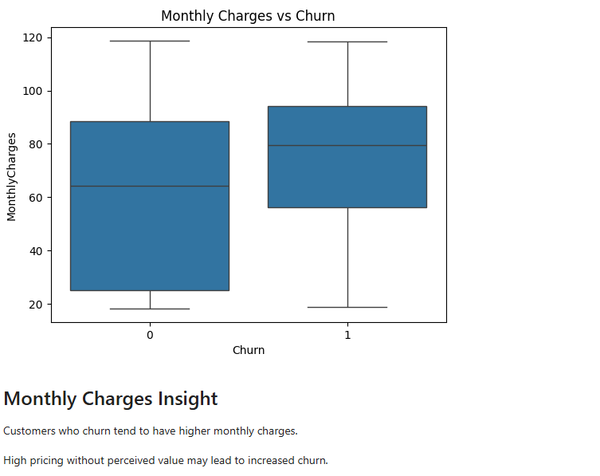

### Churn by Senior Citizen
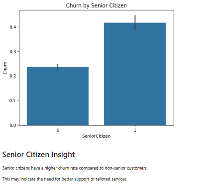

### Family Status (Partner & Dependents)
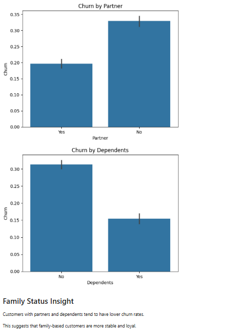

### Services & Payment Method
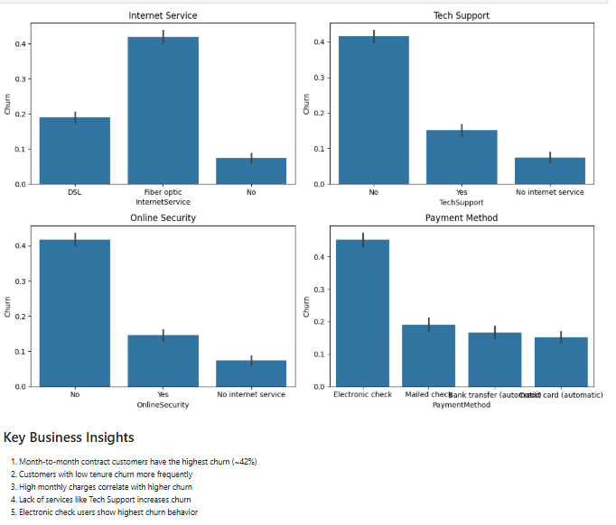

### Correlation Heatmap
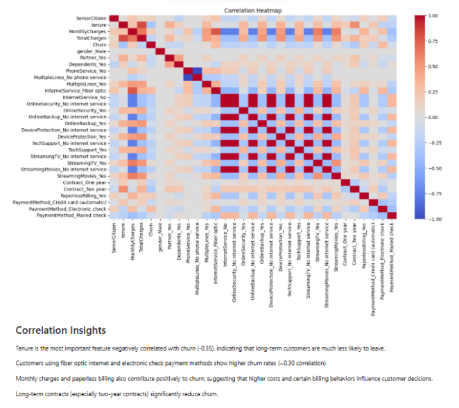

</details>

---

## ⚙️ Feature Engineering

10+ features engineered from raw 21-column dataset:

| Feature | Logic | Business Rationale |
|---|---|---|
| `tenure_group` | Bin tenure into 0–12, 12–24, 24–48, 48–72 | Segments customers by loyalty stage |
| `service_count` | Sum of all active services (0–8) | Engagement depth proxy |
| `charges_per_month_ratio` | TotalCharges / tenure | Spend consistency signal |
| `has_online_security` | Binary flag | Service stickiness |
| `high_charges_flag` | MonthlyCharges > 75th percentile | Price sensitivity risk tier |
| One-hot encoding | All categorical columns | Model-ready features |

---

## 🧠 Model Architecture

```
Raw CSV (21 cols)
      ↓
preprocess.py  →  Fix TotalCharges dtype, encode binary columns, drop CustomerID
      ↓
features.py    →  Engineer 10+ new features, one-hot encode categoricals
      ↓
train_test_split (80/20, stratified, random_state=42)
      ↓
StandardScaler  →  Fit on X_train only  →  Transform X_train + X_test
      ↓
┌────────────────┬──────────────────┬──────────────┐
│ Logistic Reg.  │  Random Forest   │   XGBoost    │
│ class_weight=  │ class_weight=    │ scale_pos_   │
│ 'balanced'     │ 'balanced'       │ weight=2.77  │
└────────────────┴──────────────────┴──────────────┘
      ↓
GridSearchCV (5-fold stratified CV) on XGBoost
      ↓
SHAP explainability → global beeswarm + per-customer waterfall
      ↓
joblib.dump → xgb_model.pkl + scaler.pkl
      ↓
Flask REST API → /predict (single) + /batch (multi) → Railway deployment
```

---

## 🚀 Live API

**Base URL:** `https://web-production-c6a31.up.railway.app/`

### Single Customer Prediction

```bash
POST /predict
Content-Type: application/json

{
  "tenure": 2,
  "MonthlyCharges": 94.0,
  "TotalCharges": 188.0,
  "Contract_One year": 0,
  "Contract_Two year": 0,
  "InternetService_Fiber optic": 1
}
```

```json
{
  "PredictedChurn": 1,
  "ChurnProbability": 0.78,
  "RiskLevel": "High",
  "latency_ms": 11.2
}
```

### Batch Scoring

```bash
POST /batch
Content-Type: application/json

[{ ...customer_1 }, { ...customer_2 }, ...]
```

Returns churn probability + risk level for up to 10,000 records.

---

## 🏗️ Project Structure

```text
customer-churn-prediction/
├── api/                         # Flask Backend & Dashboard UI
│   ├── static/                  # Dashboard assets (CSS, JS)
│   ├── templates/               # Dashboard HTML
│   └── app.py                   # Main Flask REST API
├── dashboard/                   # Business Intelligence
│   └── churn_dashboard.pbix     # Power BI interactive dashboard
│── data/                        # Datasets
│    ├── WA_Fn-UseC_-Telco-Customer-Churn.csv   # Raw dataset
│    ├── clean_df.csv                           # Clean dataset
│    └── churn_predictions.csv                  # Model output for dashboard
├── models/                      # Serialized ML Artifacts
│   ├── lr_model.pkl             # Logistic Regression Model
│   ├── X_test.pkl               # Test split
│   ├── y_test                   # Test split
│   ├── rf_model.pkl             # Random Forest Model
│   ├── xgb_model.pkl            # XGBoost Model (Production)
│   ├── scaler.pkl               # Data standard scaler
│   ├── X_train.pkl              # Train split
│   └── y_train.pkl              # Train split
├── notebooks/                   # Jupyter Notebooks for EDA & Prototyping
│   ├── 01_data_cleaning.ipynb
│   ├── 02_eda.ipynb
│   ├── 03_feature_engineering.ipynb
│   └── 04_modeling_evaluation.ipynb
├── outputs/                     # Outputs & Business Insights
│   ├── eda_plots/               # 9 EDA charts
│   ├── dashboard_screenshot     # Power BI screenshots
│   ├── business_insights.md     # 5 quantified business findings
│   ├── model_comparison.csv     # AUC, Recall, F1 for all 3 models
│   └── model_comparison.png     # roc curve
├── src/                         # Machine Learning Pipeline source code
│   ├── evaluate.py              # Model evaluation metrics
│   ├── features.py              # Feature engineering logic
│   ├── predict.py               # Inference and model loading
│   ├── preprocess.py            # Data cleaning rules
│   └── train.py                 # Model training workflow
├── .gitignore                   # Git exclusion rules
├── Procfile                     # Railway deployment configuration
├── requirements.txt             # Python dependencies
└── runtime.txt                  # Python runtime definition (3.11)
```
---

## 🛠️ Tech Stack

| Layer | Tools |
|---|---|
| Languages & Core | Python, SQL, JavaScript (Vanilla), HTML5, CSS3 |
| Data Science Libs | Pandas, NumPy, Matplotlib, Seaborn |
| Machine Learning | XGBoost, Scikit-Learn (Logistic Regression, Random Forest) |
| Backend & Framework | Flask, Gunicorn |
| Version Control & Deployment | GitHub, Railway |
| Analytics & BI | Power BI |

---

## ⚡ Quick Start

```bash
# 1. Clone
git clone https://github.com/aniket252005/customer-churn-prediction.git
cd customer-churn-prediction

# 2. Environment
python -m venv venv
source venv/bin/activate       # Windows: .\venv\Scripts\Activate.ps1

# 3. Install
pip install -r requirements.txt

# 4. Run API locally
python api/app.py
# → http://127.0.0.1:5000
```

## 📄 License

MIT License — free to use, modify, and distribute with attribution.

---

*Built with Python · scikit-learn · XGBoost · SHAP · Power BI · Flask · Railway*
*IBM Telco Customer Churn Dataset — 7,043 records · 21 features*
